<h1 align="center">Atlas</h1>

<p align="center">
  <strong>TSA Software Development 2026 Entry</strong>
</p>

---

## The Challenge


Atlas was devleoped in response to the 2026 TSA Software Development theme.

The challenge asked us to design software that improves Accessibility. When analyzing existing solutions, we found a clear technical limitation: most accessibility tools are either separate (vision or hearing) or heavily dependent on cloud APIs, which makes them unreliable in environments without stable internet access.

Our solution to this problem is Atlas. Atlas is a unified, offline-capable accessibility assitant designed to run locally on standard hardware. By leveraging optimized edge AI, the system delivers real-time sensory assistance without relying on cloud infrastructure, reducing latency while improving reliability.

---

## Features

### Vision Assist Mode

*Target User: Blind / Low Vision*


* **Low-Latency Object Detection**
  Spots obstacles and items usnig a local MobileNet-SSD model.


* **“What am I looking at?” Descriptions**
  Generates natural descriptions like *“I see a person, a laptop, and a coffee cup.”*

* **OCR Text Reader**
  Reads printed text from menus, signs, and documents using EasyOCR.
  <!-- It doesn't read aloud yet. Needs to be implemented. -->


* **Live Video Overlay**
  Displays bounding boxes and labels so users can see exactly what the AI is detecing in real time. (This is mainly for us to test, but also for caretakers).

### Hearing Assist Mode

*Target User: Deaf / Hard of Hearing*

* **Near Real-Time Captioning**
  Local speech-to-text transcription using the Whisper model.


* **Safety Alert System**
  We engineered a custom sound classifier that listens for Fire Alarms, Sirens, and Doorbells and triggers visual warnings if danger is deteced.

* **Multi-Language Support**
  Automatically identifies the spoken language during transcription.

### Accessibility-First Design


* **WCAG-Aligned UI**
  High-contrast (white-on-dark) interface for improved readability.


* **Full Keyboard Navigation**
  The application can be operated entirley without a mouse.

---

## Architecture

Atlas uses a hybrid client–server architecture that separates the user interface from the heavy AI processing. This design ensures that intensive model processing never blocks or freezes the frontend during real-time use.



### Backend Processing Pipeline


---

## Project Structure

```text
Atlas/
├── atlas-backend/              # Flask API Server (The Brains)
│   ├── app.py
│   ├── vision_processor.py
│   ├── sound_classifier.py
│   └── requirements.txt
│
├── atlas-frontend/             # PyQt6 Desktop Client (The Face)
│   ├── main.py
│   ├── tts_engine.py
│   ├── audio_engine.py
│   ├── data_overlay.py
│   └── requirements.txt
│
├── atlas-mobile/               # React Native R&D (The Future)
│   ├── App.tsx
│   ├── package.json
│   └── assets/models/
│
├── mobile_utils/
│   ├── tensor_decoder.ts
│   └── index.ts
│
├── model_engineering/
│   ├── convert_model.py
│   ├── coco_labels.txt
│   ├── README.md
│   └── output/
│
└── README.md
```

---

## Getting Started

**Requirements:** Python 3.10+, Git

### 1. Clone the Repo

```bash
git clone https://github.com/yourusername/atlas.git
cd atlas
```

### 2. Backend Setup

```bash
cd atlas-backend
python -m venv venv
pip install -r requirements.txt
```

*Note: The first run might take a minute to download the Whisper models.*

### 3. Frontend Setup

```bash
cd ../atlas-frontend
python -m venv venv
# Windows: venv\Scripts\activate
# Mac/Linux: source venv/bin/activate
pip install -r requirements.txt
```

### 4. Launch!

1. Start backend: `python app.py`
2. Start frontend: `python main.py`

---

## Mobile R&D

One of our stretch goals was to see if we could run this AI entirely on a phone, without any internet or servers.

We built an experimental React Native app and engineered a custom Quantized TFLite Model.

**Current Status:**
We were able to confirm that the 3.99MB quantized model loads successfully into Android memory and that tensor decoding functions correctly. Real-time frame processing is built but disabled in v1.0 for stability.


---

## Model Engineering

Standard server-side models are too large for mobile phones. We built a custom quantization pipeline to reduce the model size from ~30MB to 3.99MB while preserving accuracy.

**Result:** 96% size reduction using dynamic range quantization.

| Model              | Input Size | Speed | Size  |
| ------------------ | ---------- | ----- | ----- |
| `ssd_mobilenet_v1` | 300×300    | Fast  | ~4 MB |


**Reproduction:**

```bash
cd model_engineering
pip install -r requirements.txt
python convert_model.py
```

---

## Tech Stack

* **Backend:** Python, Flask, PyTorch, OpenCV, Whisper
* **Frontend:** Python, PyQt6, pyttsx3
* **Mobile:** TypeScript, React Native, Expo, TensorFlow Lite
* **Tools:** Git, Mermaid.js, VS Code

---

## To you, the reviewer

Thank you for taking the time to review our project!

Building Atlas pushed us to learn entirely new frameworks, design for real-world constraints, and dive deep into AI engineering. It was a challenging but incredibly rewarding experience to turn this idea into a working product.

We appreciate your time and consideratoin!